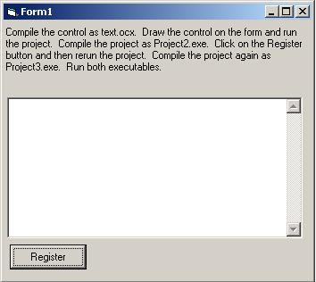



## How to make an ActiveX control \(OCX\) Shareware\.

### Description

The biggest problem with trying to make ActiveX controls shareware or trialware is knowing when the control is in the IDE. This is a demonstration on how to use the property bag to make a control shareware.
 
### More Info
 

             |
---                |---
**Submitted On**   |2003-04-09 13:00:08
**By**             |[Donathan Hutchings](https://github.com/Planet-Source-Code/PSCIndex/blob/master/ByAuthor/donathan-hutchings.md)
**Level**          |Beginner
**User Rating**    |3.7 (11 globes from 3 users)
**Compatibility**  |VB 5\.0, VB 6\.0
**Category**       |[OLE/ COM/ DCOM/ Active\-X](https://github.com/Planet-Source-Code/PSCIndex/blob/master/ByCategory/ole-com-dcom-active-x__1-29.md)
**World**          |[Visual Basic](https://github.com/Planet-Source-Code/PSCIndex/blob/master/ByWorld/visual-basic.md)
**Archive File**   |[How\_to\_mak157155492003\.zip](https://github.com/Planet-Source-Code/donathan-hutchings-how-to-make-an-activex-control-ocx-shareware__1-44635/archive/master.zip)

### Source Code

The biggest problem with trying to make ActiveX controls shareware or trialware is knowing when the control is in the IDE. All of the methods require knowing which IDE you are in. Each IDE can have a different name, executable and class. This method allows you throw the NAG screen at the proper time regardless of the IDE. Use the property bag! Set up two properties called UserName and SerialNumber. If these properties are not populated with the proper information, you are in trial mode. The attached code demonstrates how to set up a control using the property bag and a license file and you never have to worry about the IDE again.

